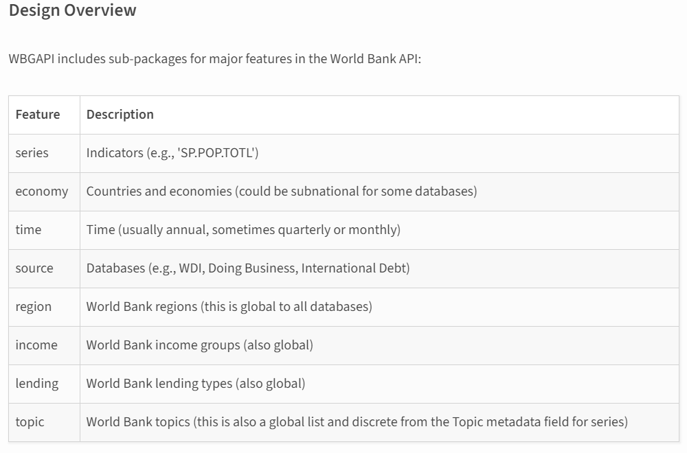

<a name="readme-top"></a>

<div align="center">
  <h1><b>Amanlyzing the World Bank Database</b></h1>
</div>


<!-- TABLE OF CONTENTS -->

# 📗 Table of Contents

- [📗 Table of Contents](#-table-of-contents)
- [World Economic Data ](#world-economic-data-)
  - [🛠 Built With ](#-built-with-)
    - [Tech Stack ](#tech-stack-)
  - [Key Features ](#key-features-)
  - [💻 Getting Started ](#-getting-started-)
    - [Setup](#setup)
    - [Prerequisites](#prerequisites)
    - [Install](#install)
    - [Usage](#usage)
  - [👥 Authors ](#-authors-)
  - [🔭 Future Features ](#-future-features-)
  - [🤝 Contributing ](#-contributing-)
  - [⭐️ Show your support ](#️-show-your-support-)
  - [🙏 Acknowledgments ](#-acknowledgments-)
  - [📝 License ](#-license-)

<!-- PROJECT DESCRIPTION -->

# World Economic Data <a name="about-project"></a>

**World Economic Data** is a repository that analysis information data made available by the world bank to draw insights. 

## 🛠 Built With <a name="built-with"></a>
### Tech Stack <a name="tech-stack"></a>

<details>
  <summary>Language</summary>
  <ul>
    <li><a href="https://rubyonrails.org/">Python</a></li>
  </ul>
</details>

<details>
<summary>Database</summary>
  <ul>
    <li><a href="https://www.postgresql.org/">PostgreSQL</a></li>
  </ul>
</details>

<details>
<summary>Storage</summary>
  <ul>
    <li><a href="https://www.postgresql.org/">Amazon RDS</a></li>
  </ul>
</details>

<p align="right">(<a href="#readme-top">back to top</a>)</p>
<!-- Features -->


## Key Features <a name="key-features"></a>

- **Interactive dashboard**
- **Store data in Amazon RDS to exploit clous based storage**


<p align="right">(<a href="#readme-top">back to top</a>)</p>

<!-- GETTING STARTED -->

## 💻 Getting Started <a name="getting-started"></a>

To get a local copy up and running, follow these steps.

### Setup

Clone this repository to your desired folder:

Example commands:

```sh
  git clone https://github.com/coderacheal/World-Economic-Data-Project.git

  cd World-Economic-Data-Project
```
### Prerequisites

In order to run this project you need create a virtual environement:

```sh
  python -m venv venv
```

### Install

In order to run this project you need run:

Example command:

```sh
  pip install
```

### Usage

To run the project, execute the following command:

Example command:

```sh
 
```

<!-- AUTHORS -->

## 👥 Authors <a name="authors"></a>

🕵🏽‍♀️ **Racheal Appiah-kubi**

- GitHub: [GitHub Profile](https://github.com/coderacheal)
- Twitter: [Twitter Handle](https://twitter.com/racheal_kubi)
- LinkedIn: [LinkedIn Profile](https://www.linkedin.com/in/racheal-appiah-kubi/)

<p align="right">(<a href="#readme-top">back to top</a>)</p>

<!-- FUTURE FEATURES -->

## 🔭 Future Features <a name="future-features"></a>

- **Add visualizations for each category**
  
  
<p align="right">(<a href="#readme-top">back to top</a>)</p>

<!-- CONTRIBUTING -->

## 🤝 Contributing <a name="contributing"></a>

Contributions, issues, and feature requests are welcome!

Feel free to check the [issues page](../../issues/).

<p align="right">(<a href="#readme-top">back to top</a>)</p>

<!-- SUPPORT -->

## ⭐️ Show your support <a name="support"></a>

If you like this project kindly show some love, give it a 🌟 **STAR** 🌟

<p align="right">(<a href="#readme-top">back to top</a>)</p>

<!-- ACKNOWLEDGEMENTS -->

## 🙏 Acknowledgments <a name="acknowledgements"></a>

I would like to thank the developer of the `wbgapi`

<p align="right">(<a href="#readme-top">back to top</a>)</p>

<!-- LICENSE -->

## 📝 License <a name="license"></a>

This project is [MIT](./LICENSE) licensed.

<p align="right">(<a href="#readme-top">back to top</a>)</p>
